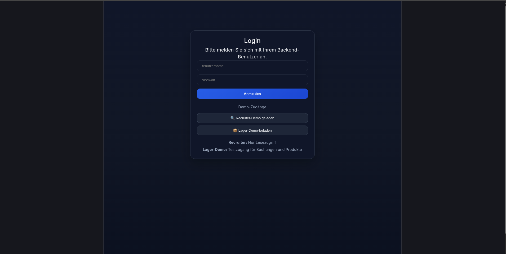
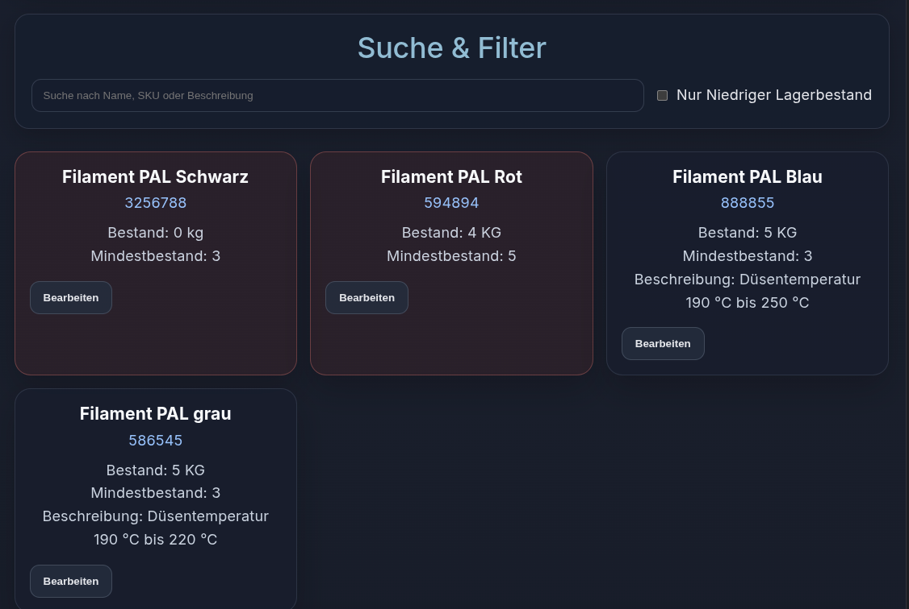
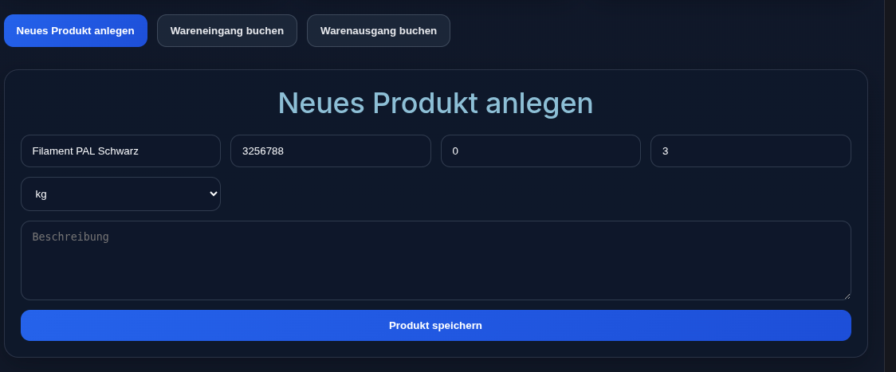
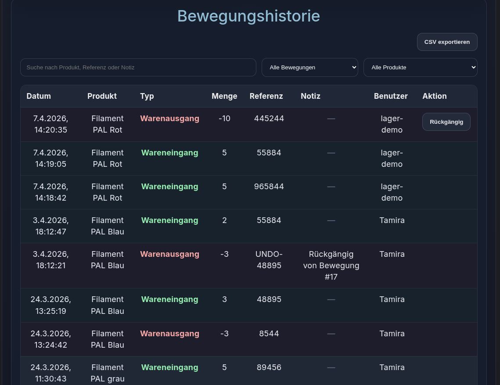

# 📦 Smart Inventory Manager

Ein moderner Fullstack Lager-Manager mit Django (Backend) und React (Frontend).

---

## 🚀 Features
- JWT Login
- Rollen: Admin / Lager / Viewer
- Produkte verwalten
- Wareneingang & Warenausgang
- Bewegungshistorie
- CSV Export

---

## 🔐 Demo-Zugänge

### 🔍 Recruiter
- Username: recruiter
- Rolle: Viewer

### 📦 Lager
- Username: lager-demo
- Rolle: Lager

---

## 🛠️ Technologien
- React + TypeScript
- Django + DRF
- JWT Auth
- SQLite
- Apache + Gunicorn

---

## 📸 Screenshots

### 🔐 Login

### 📊 Dashboard

### 📋 Produkte

### 📥 Wareneingang

### 📊 Historie

---

## 🚀 Deployment
Frontend liegt unter: /var/www/html/inventory/

Backend: /opt/smart-inventory-manager/

## 🧠 Roadmap

Geplante Erweiterungen:
- Dashboard mit Charts
- Benutzerverwaltung im UI
- Kategorien-System
- PDF Export
- Umstieg auf PostgreSQL

