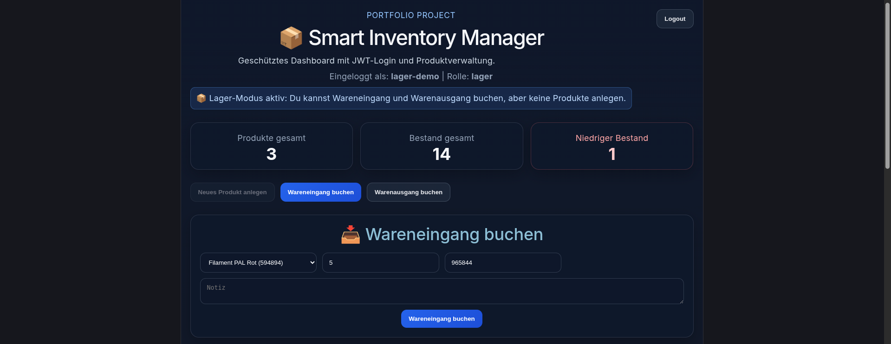

# 📦 Smart Inventory Manager

Ein skalierbarer Fullstack-Lager-Manager zur Abbildung realer Logistikprozesse.
Entwickelt mit Django REST Framework (Backend) und React + TypeScript (Frontend) sowie Deployment auf einem eigenen Linux-Server.

---

## 🧩 Projektübersicht

Der Smart Inventory Manager ist eine webbasierte Anwendung zur Verwaltung von Lagerbeständen, Warenbewegungen und Benutzerrollen.
Das System wurde praxisnah entwickelt, basierend auf realen Abläufen aus der Logistik.

---

## 🚀 Features

* 🔐 JWT Authentifizierung
* 👥 Rollenmodell (Admin / Lager / Viewer)
* 📦 Produktverwaltung
* 📥 Wareneingang & Warenausgang
* 🕓 Bewegungshistorie
* 📊 CSV Export
* ⚙️ Django Admin Integration

---

## 🔐 Demo-Zugänge

### 🔍 Recruiter (nur Ansicht)

* Username: `recruiter`
* Rolle: Viewer

### 📦 Lager (Bearbeitung)

* Username: `lager-demo`
* Rolle: Lager

---

## 🛠️ Technologien

**Frontend**

* React
* TypeScript
* Vite

**Backend**

* Django
* Django REST Framework
* JWT Authentication

**Infrastruktur**

* Linux Server (Self-hosted)
* Apache (Reverse Proxy)
* Gunicorn (Application Server)

**Datenbank**

* SQLite (aktuell)
* PostgreSQL (geplant)

---

## 🏗️ Architektur

```
[ React Frontend ]
        ↓ (API Requests)
[ Django REST API ]
        ↓
[ SQLite Database ]

Deployment:
React Build → Apache
Django → Gunicorn → Apache Reverse Proxy
```

---

## 🌍 Live Demo

👉 https://bewerbungsprofil.tamira12.duckdns.org/inventory/

---

## 📸 Screenshots

### 🔐 Login


### 📊 Dashboard


### 📋 Produkte


### 📥 Wareneingang



### 📊 Historie


---

## 💻 Installation (lokal)

### 1. Repository klonen

```bash
git clone https://github.com/Tamira70/smart-inventory-manager.git
cd smart-inventory-manager
```

---

### 2. Backend einrichten

```bash
cd backend

python3 -m venv venv
source venv/bin/activate

pip install -r requirements.txt
```

---

### 3. Datenbank vorbereiten

```bash
python manage.py migrate
```

---

### 4. Admin erstellen

```bash
python manage.py createsuperuser
```

---

### 5. Backend starten

```bash
python manage.py runserver
```

👉 Backend: http://127.0.0.1:8000/

---

### 6. Frontend starten

```bash
cd ../frontend-dashboard

npm install
npm run dev
```

👉 Frontend: http://localhost:5173/

---

## ⚙️ Voraussetzungen

* Python 3.x
* Node.js & npm
* Git

---

## 🚀 Deployment

**Frontend:**
`/var/www/html/inventory/`

**Backend:**
`/opt/smart-inventory-manager/`

**Server Setup:**

* Apache als Reverse Proxy
* Gunicorn für Django
* Linux (Self-hosted)

---

## 🎯 Projektziel

Dieses Projekt demonstriert:

* Fullstack-Webentwicklung
* API-Design & Integration
* Authentifizierung mit JWT
* Deployment auf eigener Infrastruktur
* Digitalisierung realer Logistikprozesse

---

## 🧠 Roadmap

* 📊 Dashboard mit Charts
* 👤 Benutzerverwaltung im UI
* 🏷️ Kategorien-System
* 📄 PDF Export
* 🐘 Migration auf PostgreSQL

---

## 👩‍💻 Autorin

**Tamira Morgner**
SAP Key User | Logistik | IT | Webentwicklung

---

## 📜 Lizenz

Dieses Projekt dient als Portfolio-Projekt.
