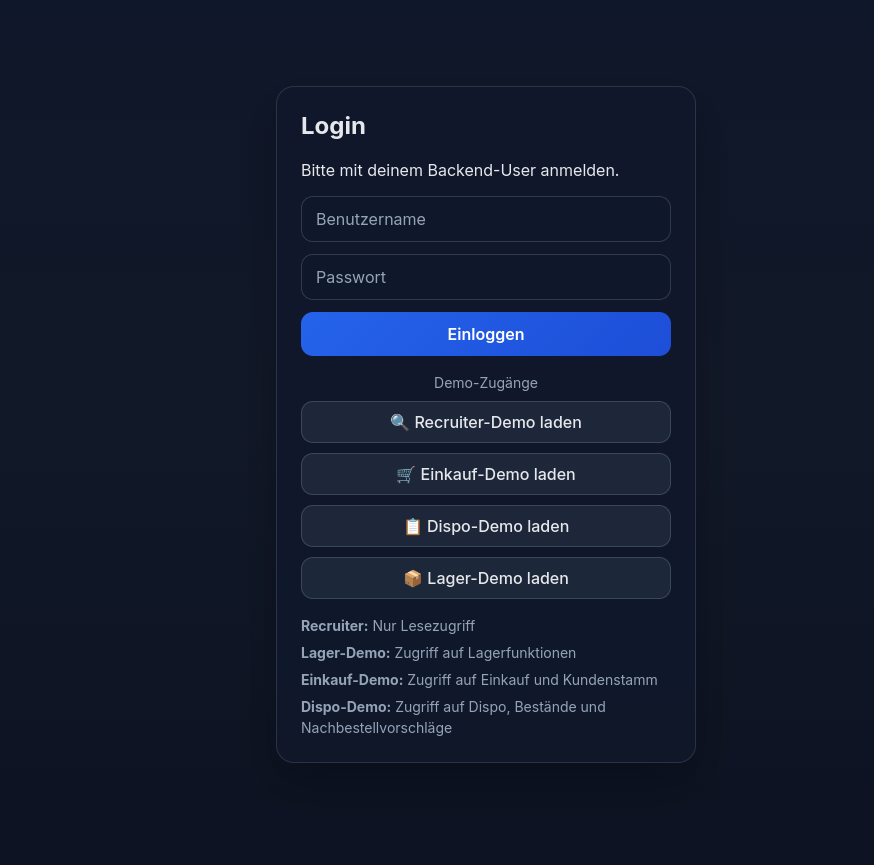
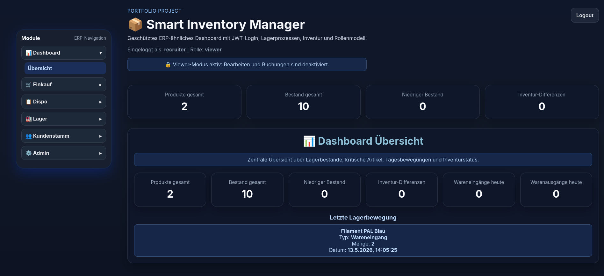
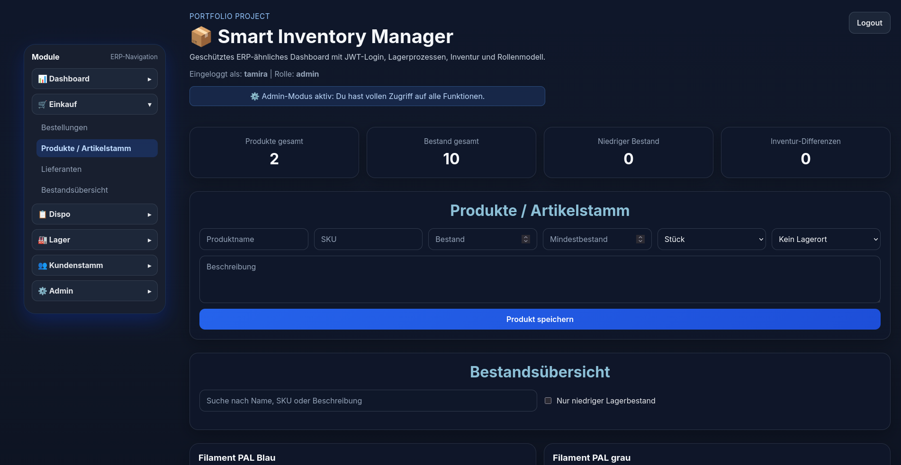
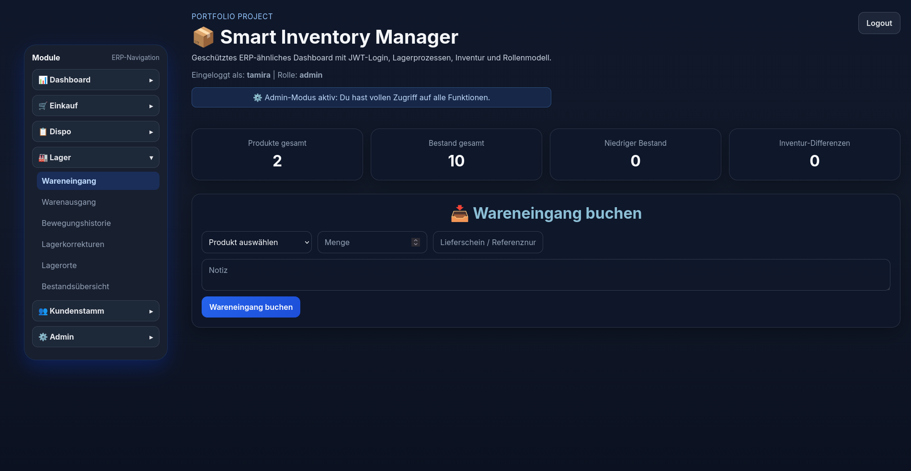
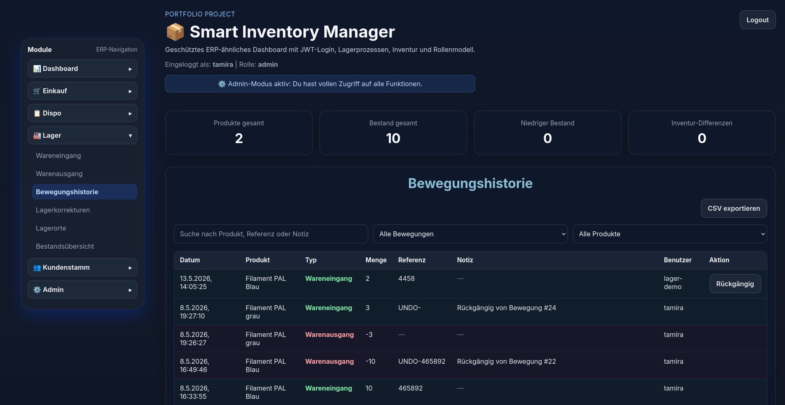
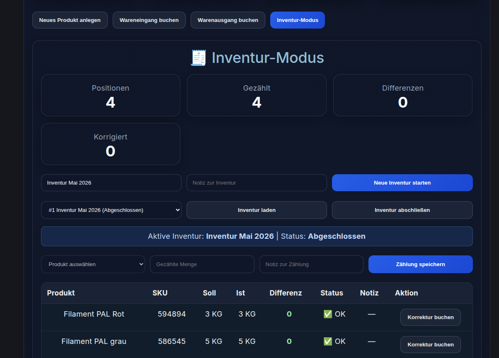

# 📦 Smart Inventory Manager

Praxisnahe Fullstack-Lagerverwaltung zur Abbildung realer Logistik- und Inventurprozesse.  
Das Projekt wurde mit **Django REST Framework** im Backend und **React + TypeScript** im Frontend entwickelt und produktiv auf einem eigenen Linux-Server mit **Apache Reverse Proxy** und **Gunicorn** deployed.

---

## 🧩 Projektübersicht

Der **Smart Inventory Manager** ist eine webbasierte Anwendung zur Verwaltung von Lagerbeständen, Warenbewegungen, Benutzerrollen und Inventurprozessen.

Die Anwendung orientiert sich an realen Abläufen aus der Logistik:

- Artikel verwalten
- Mindestbestände überwachen
- Wareneingänge buchen
- Warenausgänge buchen
- Bewegungen nachvollziehen
- Inventuren durchführen
- Soll-/Ist-Abweichungen erkennen
- Korrekturbuchungen erzeugen

---

---

## 🔐 Demo-Zugänge

### 🔍 Recruiter / Viewer

```text
Benutzername: recruiter
Passwort: demo123456
Rolle: Viewer
```

### 📦 Lager / Bearbeitung

```text
Benutzername: lager-demo
Passwort: demo123456
Rolle: Lager
```

> Hinweis: Falls die Passwörter in der Live-Version anders gesetzt sind, bitte entsprechend anpassen.

---

## 🚀 Features

### 🔐 Authentifizierung & Rollen

- JWT Authentifizierung
- Rollenmodell:
  - Admin
  - Lager
  - Viewer
- Rollenabhängige Berechtigungen
- Geschützte API-Endpunkte
- Django Admin für interne Verwaltung

### 📦 Produktverwaltung

- Produkte anlegen und bearbeiten
- SKU / Artikelnummer
- Beschreibung
- Bestand
- Einheit
- Mindestbestand
- Niedriger Bestand wird automatisch markiert

### 📥 Wareneingang & 📤 Warenausgang

- Wareneingang buchen
- Warenausgang buchen
- Referenznummer / Lieferschein erfassen
- Notizen pro Buchung
- Bestand wird automatisch aktualisiert
- Validierung bei zu geringem Bestand

### 🕓 Bewegungshistorie

- Vollständige Historie aller Lagerbewegungen
- Wareneingang / Warenausgang unterscheidbar
- Benutzer wird gespeichert
- Datum und Uhrzeit der Buchung
- Suche und Filter
- CSV-Export
- Rückgängig-Funktion für die letzte Bewegung

### 🧾 Inventur-Modus

- Inventur-Runde starten
- Produkt zur Inventur auswählen
- Soll-Bestand wird automatisch gespeichert
- Ist-Bestand / gezählte Menge eintragen
- Differenz wird automatisch berechnet
- Korrekturbuchung aus Inventur-Differenz erzeugen
- Bewegungshistorie wird automatisch ergänzt
- Inventur kann abgeschlossen werden
- Inventurpositionen im Django Admin sichtbar

### 📊 Dashboard

- Produkte gesamt
- Bestand gesamt
- Niedriger Bestand
- Inventur-Differenzen
- Übersicht über relevante Lagerkennzahlen

---

## 🛠️ Technologien

### Frontend

| Technologie | Einsatz |
|---|---|
| React | Benutzeroberfläche |
| TypeScript | Typisierte Frontend-Entwicklung |
| Vite | Entwicklungs- und Build-Tool |

### Backend

| Technologie | Einsatz |
|---|---|
| Python | Backend-Programmiersprache |
| Django | Webframework |
| Django REST Framework | REST API |
| SimpleJWT | JWT Authentifizierung |
| SQLite | Datenbank aktuell |

### Infrastruktur

| Technologie | Einsatz |
|---|---|
| Linux Server | Self-hosted Deployment |
| Apache | Reverse Proxy und Frontend-Auslieferung |
| Gunicorn | Django Application Server |
| systemd | Backend-Service |
| HTTPS | Sichere Verbindung über Domain |

---

## 🏗️ Architektur

```text
Browser
   ↓
React Frontend
   ↓
Apache Reverse Proxy
   ↓
Django REST API
   ↓
SQLite Datenbank
```

Deployment-Struktur:

```text
Frontend Build:
    /var/www/html/inventory/

Backend:
    /opt/smart-inventory-manager/

Service:
    smart-inventory.service

API Proxy:
    /inventory-api/ → Django Backend
```

---

## 🔗 API-Endpunkte

| Methode | Endpoint | Beschreibung |
|---|---|---|
| POST | `/api/login/` | JWT Login |
| POST | `/api/token/refresh/` | Access Token erneuern |
| GET | `/api/products/` | Produkte abrufen |
| POST | `/api/products/` | Produkt anlegen |
| PUT | `/api/products/<id>/` | Produkt bearbeiten |
| GET | `/api/stock-movements/` | Bewegungen abrufen |
| POST | `/api/stock-movements/` | Wareneingang / Warenausgang buchen |
| GET | `/api/inventory-sessions/` | Inventur-Runden abrufen |
| POST | `/api/inventory-sessions/` | Inventur-Runde erstellen |
| POST | `/api/inventory-sessions/<id>/complete/` | Inventur abschließen |
| GET | `/api/inventory-counts/` | Inventurpositionen abrufen |
| POST | `/api/inventory-counts/` | Inventurposition speichern |
| POST | `/api/inventory-counts/<id>/apply-correction/` | Korrekturbuchung erzeugen |

---

## 📸 Screenshots

### 🔐 Login



### 📊 Dashboard



### 📋 Produkte



### 📥 Wareneingang



### 🕓 Bewegungshistorie



### 🧾 Inventur-Modus



> Hinweis: Falls ein Screenshot noch nicht vorhanden ist, kann er später im Ordner `screenshots/` ergänzt werden.

---

## 💻 Installation lokal

### 1. Repository klonen

```bash
git clone https://github.com/Tamira70/smart-inventory-manager.git
cd smart-inventory-manager
```

---

## 🐍 Backend einrichten

Virtuelle Umgebung erstellen:

```bash
python3 -m venv venv
source venv/bin/activate
```

Abhängigkeiten installieren:

```bash
python -m pip install --upgrade pip
python -m pip install -r requirements.txt
```

Datenbank vorbereiten:

```bash
python manage.py migrate
```

Admin-User erstellen:

```bash
python manage.py createsuperuser
```

Backend starten:

```bash
python manage.py runserver
```

Backend läuft unter:

```text
http://127.0.0.1:8000/
```

Django Admin:

```text
http://127.0.0.1:8000/admin/
```

---

## ⚛️ Frontend einrichten

In einem zweiten Terminal:

```bash
cd frontend
npm install
npm run dev
```

Frontend läuft unter:

```text
http://localhost:5173/inventory/
```

---

## ⚙️ Lokaler Vite Proxy

Für die lokale Entwicklung wird `/inventory-api/` an das Django Backend weitergeleitet.

Beispiel `vite.config.ts`:

```ts
import { defineConfig } from "vite";
import react from "@vitejs/plugin-react";

export default defineConfig({
  plugins: [react()],
  base: "/inventory/",
  server: {
    proxy: {
      "/inventory-api": {
        target: "http://127.0.0.1:8000",
        changeOrigin: true,
        rewrite: (path) => path.replace(/^\/inventory-api/, "/api"),
      },
    },
  },
});
```

---

## 🚀 Deployment

### Frontend

Produktionsbuild erstellen:

```bash
cd frontend
npm run build
```

Build-Dateien werden auf dem Server ausgeliefert über:

```text
/var/www/html/inventory/
```

### Backend

Backend liegt auf dem Server unter:

```text
/opt/smart-inventory-manager/
```

Gunicorn läuft als systemd-Service:

```text
smart-inventory.service
```

### Apache Reverse Proxy

Apache leitet API-Anfragen weiter:

```apache
ProxyPass /inventory-api/ http://127.0.0.1:8001/api/
ProxyPassReverse /inventory-api/ http://127.0.0.1:8001/api/
```

---

## 🧪 Inventur-Beispiel

Beispielprozess:

```text
1. Inventur starten
2. Produkt auswählen
3. Systembestand wird als Soll-Bestand gespeichert
4. Gezählt wird z. B. 4 kg statt 6 kg
5. Differenz = -2 kg
6. Korrekturbuchung erzeugt automatisch Warenausgang
7. Produktbestand wird aktualisiert
8. Bewegungshistorie erhält Inventur-Korrektur
```

---

## 🎯 Projektziel

Dieses Projekt demonstriert:

- Fullstack-Webentwicklung mit Django und React
- REST API Design
- JWT Authentifizierung
- Rollen- und Berechtigungskonzept
- Digitalisierung realer Logistikprozesse
- Wareneingang und Warenausgang
- Bewegungshistorie
- Inventur mit Soll-/Ist-Vergleich
- Automatische Korrekturbuchungen
- Deployment auf eigener Linux-Infrastruktur
- Verbindung von Logistikpraxis und IT-Umsetzung

---

## 🧠 Roadmap

Geplante Erweiterungen:

- 📊 Dashboard mit erweiterten Charts
- 📤 Excel-Export für Bestände und Inventurberichte
- 🏷️ Kategorien und Lagerorte
- 📄 PDF-Export für Inventurberichte
- 🐘 Migration auf PostgreSQL
- 📱 QR-Code / Barcode-Funktion

---

## 👩‍💻 Autorin

**Tamira Morgner**  
SAP Key User | Logistik | IT | Webentwicklung

GitHub: [Tamira70](https://github.com/Tamira70)

---

## 📜 Lizenz

Dieses Projekt dient als Portfolio-Projekt.