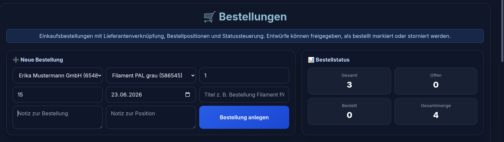
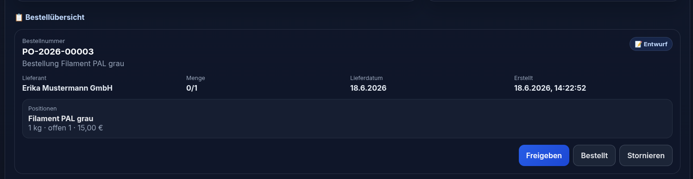
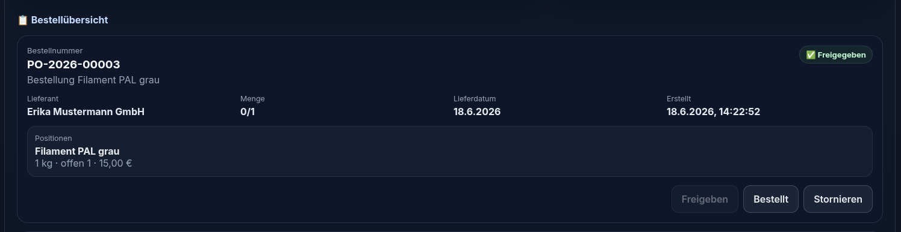
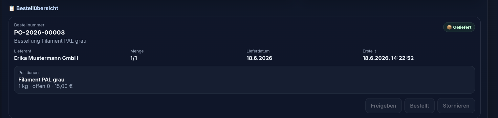
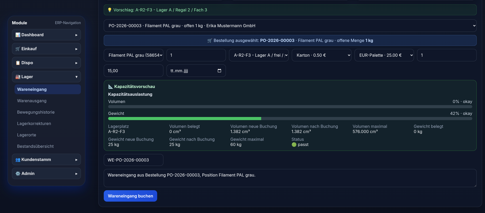
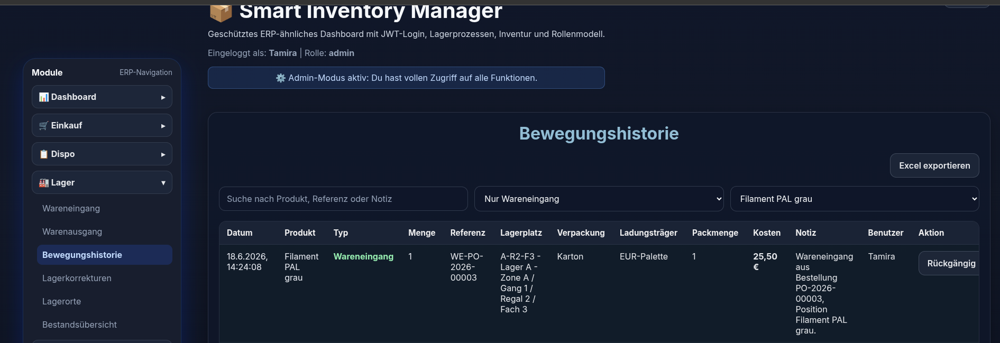

# 📦 Smart Inventory Manager – Feature Branch `feature/lagerorte`

Dieser Branch enthält die erweiterte Lagerplatz- und WMS-Logik des **Smart Inventory Manager**.

## Schwerpunkt dieses Branches

- Lagerorte und Lagerplatzbestände
- Wareneingang mit Lagerplatz, Verpackung und Ladungsträger
- Warenausgang von konkretem Lagerplatz
- automatische Frei-/Belegt-Synchronisierung der Lagerplätze
- Kapazitätsprüfung nach Volumen und Gewicht
- Verpackungsarten und Ladungsträger
- Einstandspreise für HIFO/LOFO
- MHD/Ablaufdatum für FEFO
- Auslagerstrategien FIFO, LIFO, FEFO, HIFO und LOFO
- Excel-Export für Bewegungshistorie
- Excel-Export für Inventurberichte
- Excel-Export für Lagerplatzbestände

## Status

Dieser Branch dient der Weiterentwicklung der Lager-IT-/WMS-Funktionen.  
Die wichtigsten Lagerplatz-, Kapazitäts- und Auslagerstrategien sind lokal und auf dem Server getestet.

## Technologie

- Django REST Framework
- React mit TypeScript
- SQLite lokal
- Apache + Gunicorn auf Linux-Server
- openpyxl für Excel-Exporte

## Ziel

Das Projekt zeigt praxisnahe Logistik-IT, ERP-/SAP-nahe Prozesslogik und digitale Lagerverwaltung in einer eigenen Full-Stack-Anwendung.

---
<<<<<<< Updated upstream
=======

## 📸 Screenshots – Bestellprozess

Der Bestellprozess zeigt den Ablauf von der Einkaufsbestellung bis zur automatischen Lagerbewegung im Wareneingang.

| Neue Bestellung | Status: Entwurf |
|---|---|
|  |  |

| Status: Freigegeben | Status: Geliefert |
|---|---|
|  |  |

| Wareneingang aus Bestellung | Automatische Lagerbewegung |
|---|---|
|  |  |

---

### 📸 Screenshots für die Projektdokumentation

Geplante Screenshots für die Portfolio-Dokumentation:

- Bestellübersicht mit PO-Nummern
- Neue Bestellung mit Lieferant und Produktposition
- Bestellstatus mit ENTWURF / FREIGEGEBEN / BESTELLT / ERHALTEN
- Wareneingang mit ausgewählter offener Bestellposition
- Automatisch erzeugte Lagerbewegung mit Referenz `WE-PO-...`

### 🚜 WMS-/Lagerleitsystem: Wareneingangsflächen, Transportauftrag & Stapler-Terminal

#### 🟨 Teilweise umgesetzt

Der Smart Inventory Manager wurde um eine erste WMS-/Lagerleitlogik erweitert. Der Wareneingang wird nicht mehr direkt auf normale Lagerplätze gebucht, sondern zuerst auf definierte Wareneingangsflächen. Von dort erzeugt das System automatisch Transportaufträge für die weitere Einlagerung.

Bereits lokal umgesetzt:

- Lagerplatztypen für unterschiedliche Lagerbereiche:
  - `RECEIVING` = Wareneingangsfläche
  - `STORAGE` = regulärer Lagerplatz
  - `SHIPPING` = Warenausgang / Bereitstellung
  - `QUALITY` = Prüfung / Klärung
  - `BLOCKED` = Sperrfläche
- Wareneingangsflächen `WE-0001` bis `WE-0005`
- Wareneingang nur noch auf WE-Flächen
- Dashboard-Anzeige für freie und belegte WE-Flächen
- automatische Prüfung belegter WE-Flächen
- automatische TA-Erstellung, wenn Bestand auf einer WE-Fläche liegt und noch kein offener TA existiert
- Schutz vor doppelten Transportaufträgen für denselben WE-Bestand
- automatische Erstellung von TA-Nummer und TS-Nummer
- automatische Ermittlung eines geeigneten Ziel-Lagerplatzes
- Stapler-Terminal mit TA-Liste, aktuellem Auftrag und Ein-Scan-Feld
- Scan-Logik für Quellplatz und Zielplatz
- Bestandsumbuchung von WE-Fläche auf Lagerplatz beim Abschluss des Transportauftrags
- automatische OUT- und IN-Lagerbewegung mit TA-Referenz

#### 🔜 Nächster Ausbau

- Stapler-Terminal weiter optimieren
- akustische Warnung und visuelle Fehlerführung weiter ausbauen
- automatische 15-Minuten-Prüfung später als Hintergrunddienst oder Scheduler betreiben
- Warenausgangsflächen `WA-0001` bis `WA-0005`
- Transportaufträge vom Lagerplatz zur WA-/Bereitstellfläche
- Erweiterung für Palette / NVE / SSCC
- direkte Zuweisung von Transportaufträgen an Stapler oder Benutzer